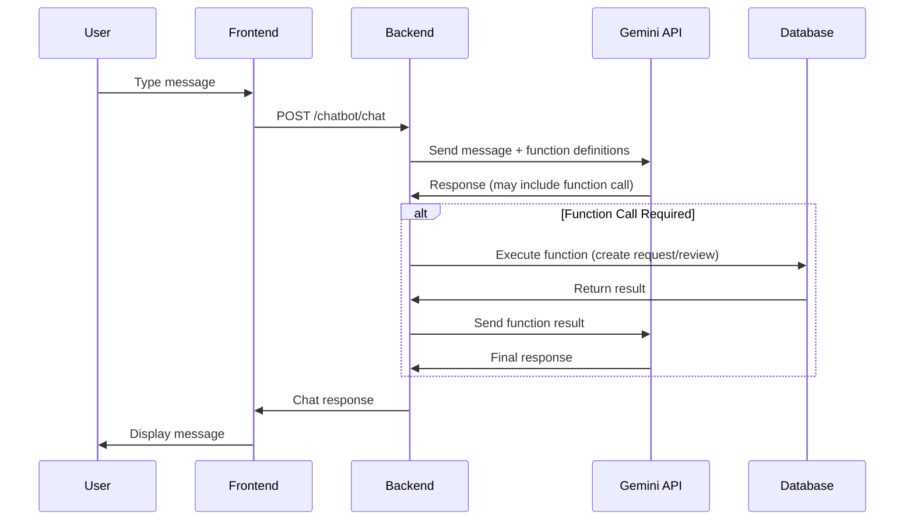

# Chatbot Architecture Plan

## Overview
Implement a Google Gemini-powered chatbot that helps users request accessibility services and submit reviews for locations in Boston.

## Key Features

### 1. Conversational AI
- Natural language understanding via Google Gemini API
- Context-aware responses about accessibility in Boston
- Multi-turn conversations with chat history

### 2. Function Calling Capabilities
The chatbot will use Gemini's function calling to:
- **Create Service Requests**: Request wheelchair ramps, accessible parking, etc.
- **Submit Reviews**: Create accessibility reviews for locations
- **Query Location Data**: Search existing reviews and locations
- **Provide Information**: Answer questions about the app and accessibility

### 3. Service Request Management
New database system for tracking accessibility service requests:
- Request type (e.g., ramp, parking, signage)
- Location (lat/lng + address)
- Description and priority
- Status tracking (pending, in-progress, completed)
- Timestamp metadata

## Technical Architecture

### Backend Components

#### 1. Service Requests API (`src/backend/routes/service_requests.py`)
- Similar structure to reviews.py
- CRUD operations for service requests
- Parquet file storage: `src/backend/data/service_requests.parquet`
- Endpoints:
  - `POST /service-requests` - Create request
  - `GET /service-requests` - List all requests
  - `GET /service-requests/{id}` - Get specific request
  - `PATCH /service-requests/{id}/status` - Update status
  - `DELETE /service-requests/{id}` - Delete request

#### 2. Chatbot API (`src/backend/routes/chatbot.py`)
- Main chat endpoint: `POST /chatbot/chat`
- Conversation history management
- Gemini API integration with function calling
- Function definitions for:
  - `create_service_request()`
  - `create_review()`
  - `search_locations()`
  - `get_location_reviews()`

#### 3. Configuration Updates (`src/backend/config.py`, `.env.example`)
- Add `GEMINI_API_KEY` environment variable
- Add `GEMINI_MODEL` setting (default: "gemini-2.0-flash-exp")

### Frontend Components

#### 1. Chatbot Page (`src/frontend/pages/chatbot.py` or integrated into `main.py`)
- Chat interface with message history
- User input field
- Real-time message streaming
- Display function call results (service requests, reviews created)
- Session state for conversation context

#### 2. Main App Updates (`src/frontend/main.py`)
- Add "AI Assistant" or "Chatbot" menu item
- Route to chatbot page

## Data Models

### Service Request Model
```python
{
    "request_id": str,
    "request_type": str,  # "ramp", "parking", "signage", "other"
    "location_id": str,
    "latitude": float,
    "longitude": float,
    "address": str,
    "description": str,
    "priority": str,  # "low", "medium", "high"
    "status": str,  # "pending", "in-progress", "completed"
    "requester_name": str,
    "requester_email": str,
    "created_at": datetime,
    "updated_at": datetime
}
```

### Chat Message Model
```python
{
    "role": str,  # "user" or "assistant"
    "content": str,
    "timestamp": datetime,
    "function_call": Optional[dict]  # If action was taken
}
```

## System Prompts

The chatbot will be initialized with a system prompt:

```
You are MapAble Assistant, an AI helper for MapAble Boston - an accessibility-focused 
application that helps people find and rate accessible places in Boston.

Your capabilities:
1. Answer questions about accessibility in Boston and the app
2. Help users request accessibility improvements (ramps, parking, signage)
3. Assist in submitting accessibility reviews for locations
4. Search and query existing location reviews and ratings

Be friendly, helpful, and accessibility-aware. Always ask for required information 
before creating service requests or reviews.
```

## Implementation Flow



## Security Considerations

1. **API Key Protection**: Store Gemini API key in environment variables
2. **Input Validation**: Validate all user inputs before processing
3. **Rate Limiting**: Implement rate limiting on chatbot endpoint
4. **Data Privacy**: Don't log sensitive user information

## Testing Strategy

1. **Unit Tests**: Test service request CRUD operations
2. **Integration Tests**: Test chatbot with mock Gemini responses
3. **End-to-End Tests**:
   - Create service request via chat
   - Submit review via chat
   - Query existing data via chat
   - Handle error scenarios gracefully

## Future Enhancements

- Multi-language support
- Voice input/output
- Image upload for service requests
- Integration with city services API
- Email notifications for service request updates